Cardinal Creek is one of the last remaining natural treasures in Orleans.
It houses a full ecosystem: a variety of native trees, plants and flowers feed a number of insects and small animals, which attract larger predators.

The southern section of the creek karst is recognized by Ontario’s Ministry of Natural Resources as an Area of Natural and Scientific Interest (ANSI).
The entire creek has also been monitored by the Rideau Valley Conservation Authority’s City Stream Watch.
Download the pdf: stream_watch_final.pdf

Discover the many plants and creatures of Cardinal Creek!

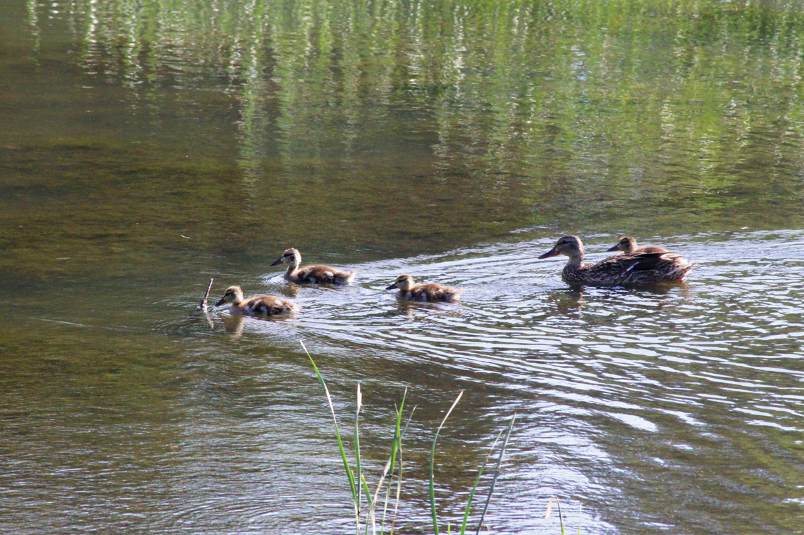
A mallard duck with her ducklings.

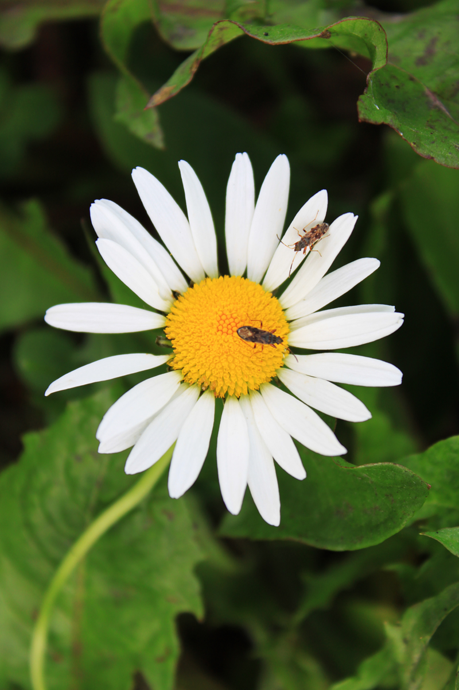
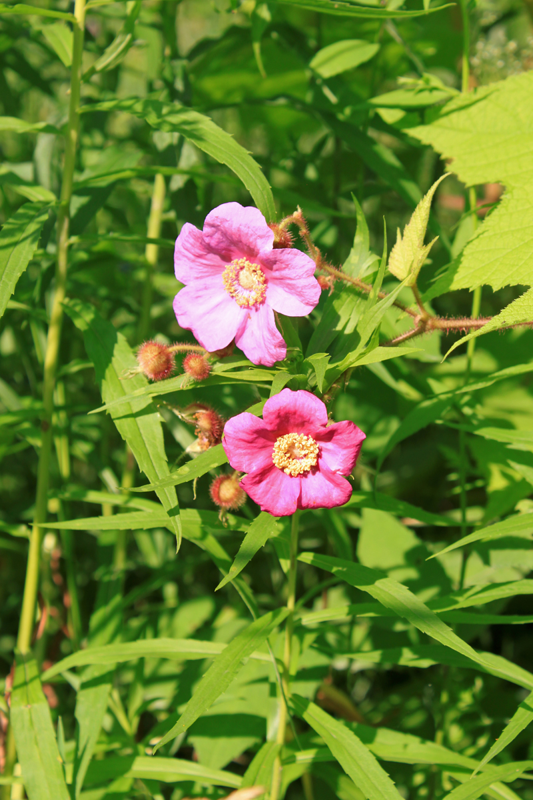

Damsel bugs are known as beneficial insects for gardeners, as they eat insects who feast on daisy petals.

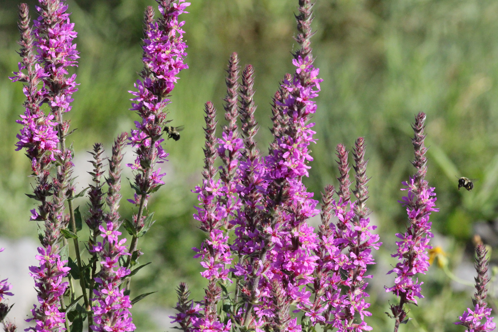

Bees pollinating purple loose strife. This plant is native to Europe, and was introduced to North America by bee keepers, due to its abundance of nectar. Overpopulation of the species can cause harm in North America, as the loose strife can wipe out native plants essential to biodiversity. Luckily, there aren’t too many in Cardinal Creek, although they are beautiful!

 
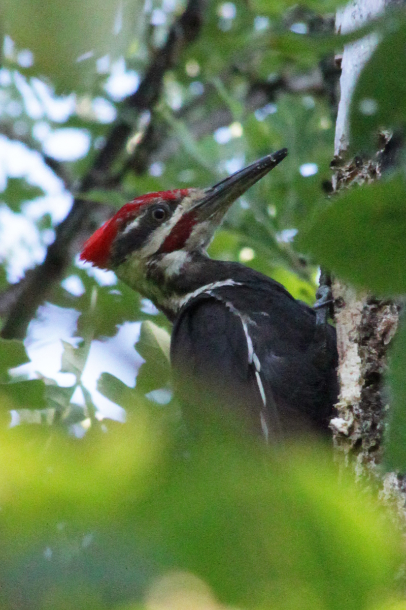
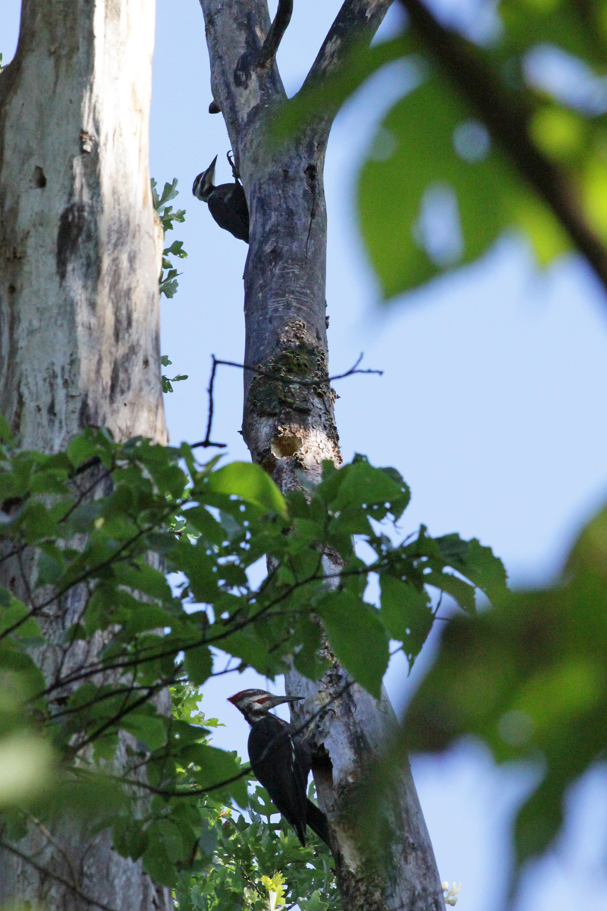

Pileated woodpeckers. In April, the male pileated woodpecker will make a hole in a tree, to nest its young. The pair stays together on its territory all year, and both parents take care of the eggs. Once the brood is raised, the hole is abandoned, and later houses other songbird species.

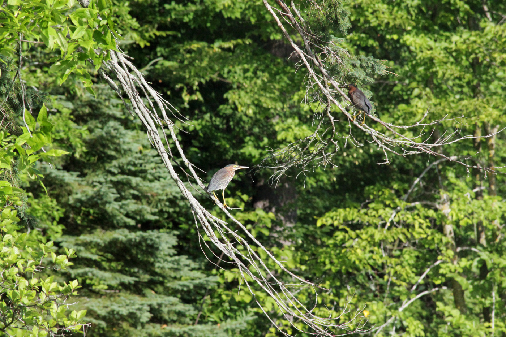

Two green herons. These birds eat small fish, frogs, other aquatic creatures, and sometimes mice. To attract their prey, they often drop food, insects, or small objects into the water. This method of feeding using tools makes them known as one of the most intelligent bird species in the world.

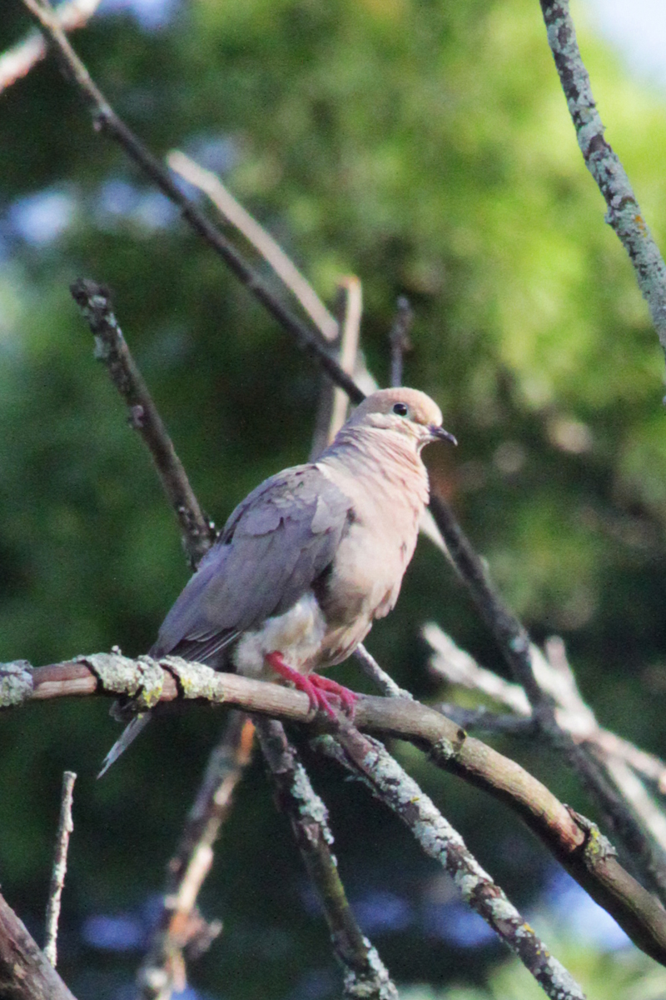
 
Mourning dove. This ‘bird of peace’ almost exclusively eats seeds.

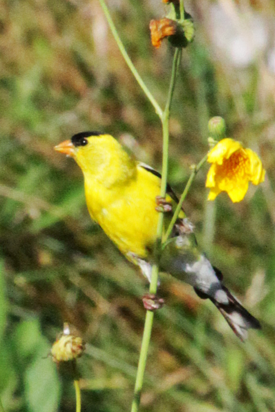

American goldfinch (or wild canary). Another granivore, this bird almost exclusively eats seeds as well. The open meadow is its preferred habitat, where it can perch on wildflowers.

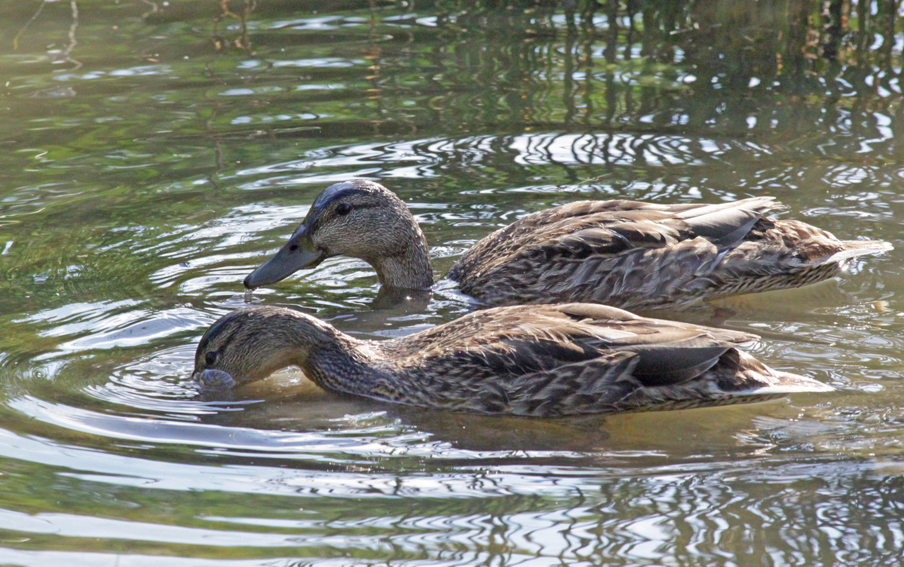

A pair of mallard ducks.

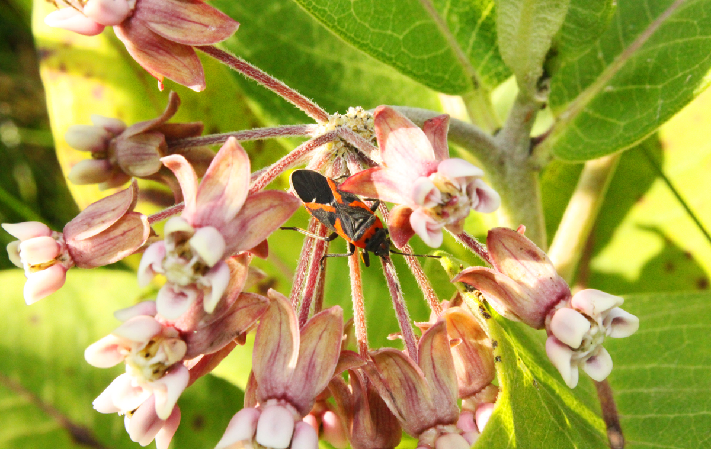

Milkweed bug feeding on milkweed.

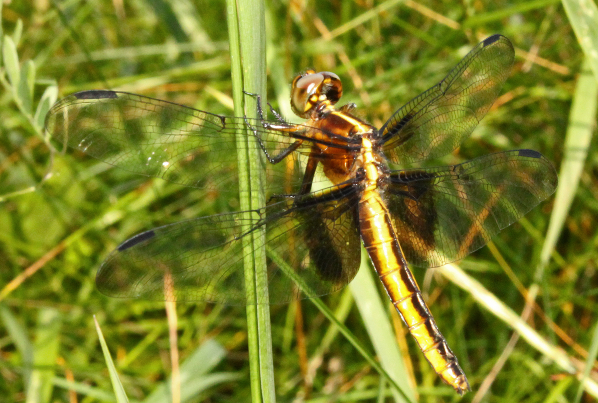

A dragonfly resting on tall grass.

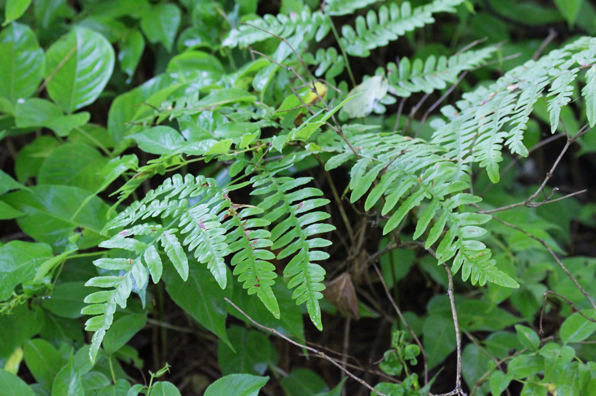
 
Fern growing at the bed of the Cardinal Creek forest.

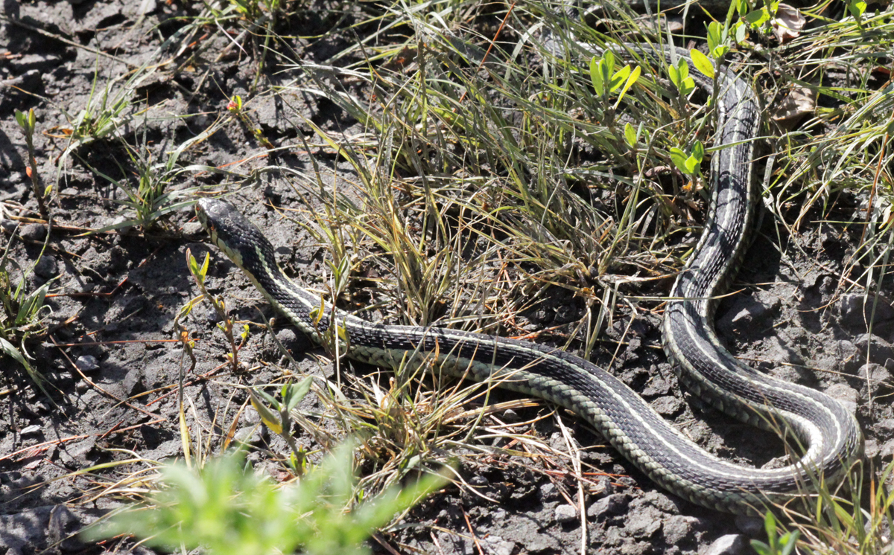

Garter snake. This snake is an important member of the creek’s ecosystem, as it eats frogs, fish, and sometimes mice. Its predators include raccoons, skunks, and birds such as crows and hawks.

Photos by Kathleen Black
